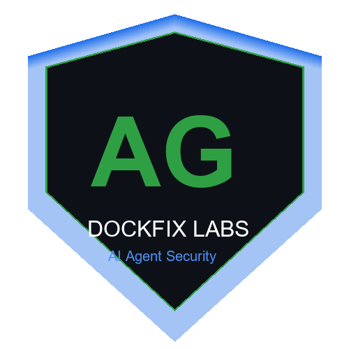



  

<h1 align="center">Dockfix Labs</h1>

Building open-source security tools for the AI agent era

---

## Projects

| Project | Description |
|---------|-------------|
| [AgentGuard](https://github.com/dockfixlabs/agentguard) | Autonomous security scanner for AI agents — OWASP ASI Top 10 detection |
| [MCP Scanner](https://github.com/dockfixlabs/mcp-scanner) | Security scanner for MCP (Model Context Protocol) servers |
| [AgentGuard App](https://github.com/dockfixlabs/agentguard-app) | GitHub App for automated PR security reviews |
| [AgentGuard VS Code](https://github.com/dockfixlabs/agentguard-vscode) | VS Code extension — inline security diagnostics for agent code |
| [AgentGuard Benchmark](https://github.com/dockfixlabs/agentguard-benchmark) | Benchmark suite with 27+ vulnerable agent code samples |

## Focus

- AI Agent Security (OWASP ASI Top 10)
- MCP Protocol Security
- Developer Tooling

## Packages

- [dfx-agentguard](https://pypi.org/project/dfx-agentguard/) on PyPI
- [dfx-mcp-scanner](https://pypi.org/project/dfx-mcp-scanner/) on PyPI

## Contact

- [GitHub Discussions](https://github.com/dockfixlabs/agentguard/discussions)

---

<em>Securing the autonomous web.</em>
